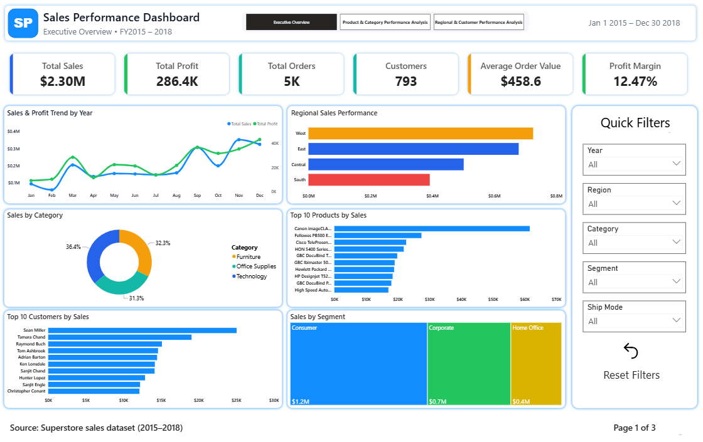
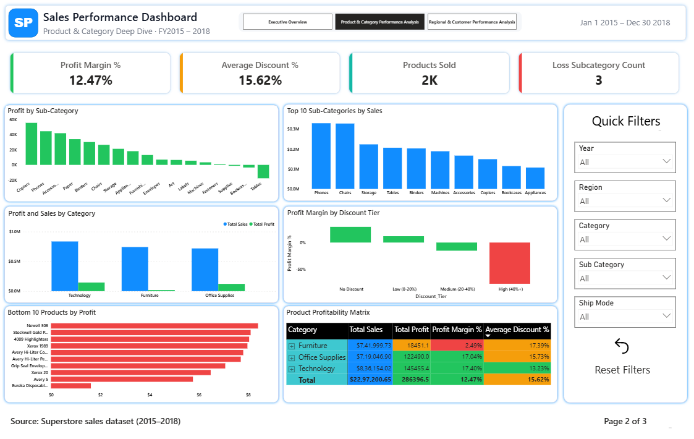
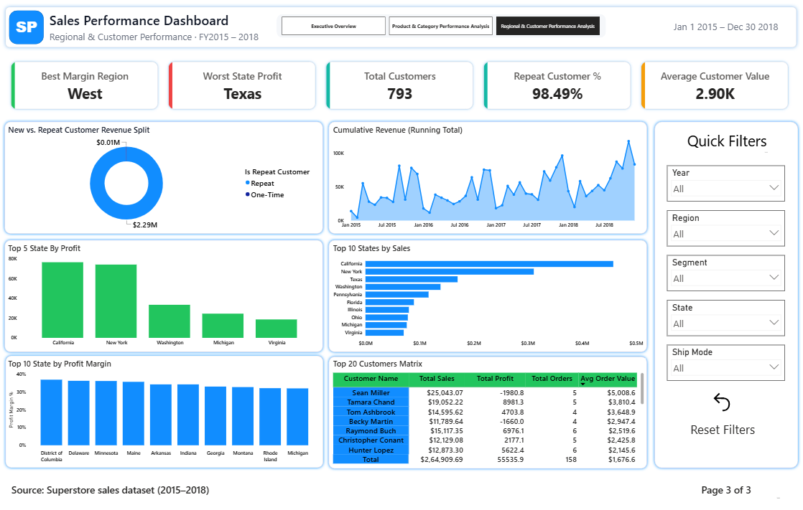

# 📊 Sales Performance Analytics Dashboard

An end-to-end **Business Intelligence** project built using **Power BI, Python, and SQL** to analyze retail sales data and deliver actionable business insights on sales, profit, products, customers, and regional performance.

---

## 🎯 Project Objective

The objective of this project is to analyze retail sales data, identify revenue trends, evaluate product and customer performance, understand regional profitability, and present insights through an interactive **3-page Power BI dashboard**.

---

## 📊 Key Performance Indicators

| KPI | Value |
|------|--------|
| Total Sales | **$2.30M** |
| Total Profit | **$286.40K** |
| Profit Margin | **12.47%** |
| Total Orders | **5,009** |
| Total Customers | **793** |

---

## 📌 Dashboard Preview & Features

### 📄 Page 1 – Executive Overview

---

### Executive Overview



---
- Executive KPI Cards
- Monthly Sales & Profit Trend
- Regional Sales Performance
- Sales by Category
- Top 10 Products
- Top 10 Customers
- Sales by Segment
- Interactive Slicers

### 📄 Page 2 – Product & Category Analysis

---

### Product & Category Analysis



---

- Profit by Sub-Category
- Top Selling Sub-Categories
- Profit & Sales by Category
- Profit Margin by Discount Tier
- Bottom 10 Products by Profit
- Product Profitability Matrix

### 📄 Page 3 – Regional & Customer Analysis

---

### Regional & Customer Analysis



---

- Best Margin Region
- Running Revenue Trend
- Top States by Sales
- Top States by Profit Margin
- New vs Repeat Customer Revenue
- Customer Performance Matrix

---

## 🧹 Data Cleaning & Preparation

- Cleaned missing and duplicate records
- Converted data types
- Created date hierarchy (Year, Quarter, Month)
- Created calculated columns and DAX measures
- Built KPIs for Sales, Profit, Orders, Customers, and Profit Margin
- Prepared the dataset for Power BI visualization

---

## 💡 Key Business Insights

- Technology generated the highest revenue.
- West region achieved the highest sales and profit.
- Tables and Bookcases are loss-making products.
- Profit margin drops significantly when discounts exceed **40%**.
- Some high-revenue customers generated negative profit.
- Repeat customers contribute the majority of total revenue.
- Seasonal sales trends indicate stronger business performance during year-end months.

---

## 🛠️ Tools & Technologies

- Power BI Desktop
- Power Query
- DAX
- Python (Pandas, NumPy, Matplotlib)
- SQL (SQLite)
- Jupyter Notebook
- Git & GitHub

---

## 📂 Project Structure

```text
sales-performance-dashboard/
│
├── data/
├── notebooks/
├── sql/
├── dashboard/
├── images/
├── screenshots/
├── requirements.txt
└── README.md
```

---

## 📂 Dataset

**Superstore Sales Dataset (Kaggle)**

https://www.kaggle.com/datasets/vivek468/superstore-dataset-final

---

## 🚀 How to Use

git clone https://github.com/Himanshu04082/sales-performance-dashboard.git
cd sales-performance-dashboard

pip install -r requirements.txt

# Run the data-cleaning / EDA notebooks
jupyter notebook notebooks/

# Set up the MySQL database
# 1. Create the database in MySQL:
CREATE DATABASE superstore;

# 2. Run the MySQL schema:
sql/00_schema_mysql.sql

# 3. Update MySQL credentials in:
notebooks/load_data_mysql.py

# 4. Load the cleaned dataset:
python notebooks/load_data_mysql.py

# 5. Run the SQL analysis:
sql/01_business_queries.sql
sql/02_advanced_queries.sql

# Open the Power BI dashboard:
dashboard/Sales_Performance_Dashboard.pbix

---

## 👨‍💻 Author

**Himanshu**

📧 himanshu987574@gmail.com

🔗 LinkedIn: *www.linkedin.com/in/himanshu-lamba-54136833a*

⭐ If you found this project useful, don't forget to give it a **Star**.
